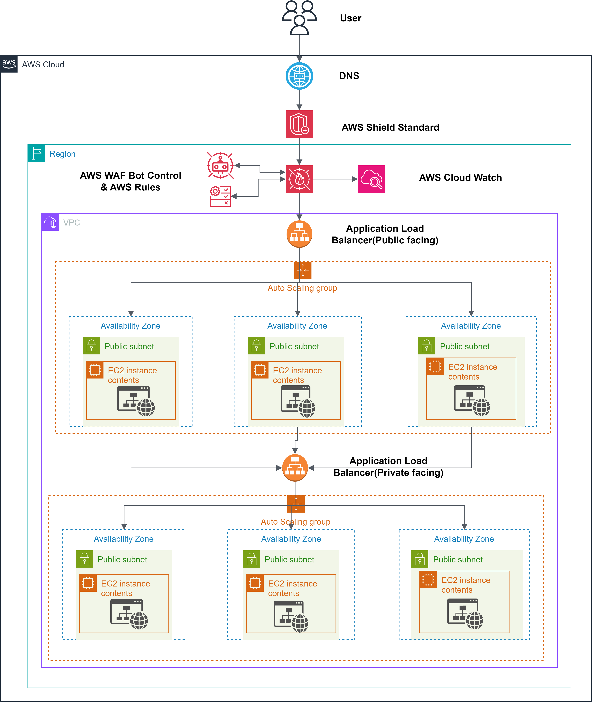

# AWS-Based Secure and Scalable Web Application

## Project Overview

This project demonstrates a secure, scalable web application architecture designed for the **Smart India Hackathon**. The solution leverages various AWS services such as **AWS WAF**, **AWS Shield**, **EC2**, **Auto Scaling**, and **Load Balancers** to provide high availability, DDoS protection, and resilience.

## Architecture Overview

The architecture follows a multi-layered security model with both public-facing and private-facing load balancers. Key components include:
- **AWS WAF & Shield**: Protection against DDoS attacks and bot traffic.
- **Auto Scaling**: Ensures the application can handle high traffic by automatically scaling the EC2 instances.
- **Load Balancers**: Distributes traffic across multiple instances to maintain high availability.

For detailed architecture information, see [Architecture Description](architecture/architecture-description.md).

## Features

- **DDoS Protection**: AWS Shield and WAF rules help defend against malicious traffic.
- **Auto Scaling**: Automatically adjusts the number of instances based on traffic.
- **Load Balancing**: Provides resilience and ensures that traffic is evenly distributed.
- **AWS CloudWatch**: Monitors the application for performance and security insights.

## Manual Setup Instructions

This project was configured using the AWS Management Console. For setup instructions, refer to the relevant files in the `config-details/` folder:
- [AWS Service Configuration](config-details/aws-config.md)
- [Security Configuration](config-details/security-settings.md)
- [Scaling and Load Balancing Setup](config-details/scaling-and-load-balancing.md)

## Usage

After deploying the application, access it via the **public-facing Load Balancer URL**. 

## Future Enhancements

- Transition to Infrastructure as Code (IaC) with Terraform or CloudFormation.
- Implement a CI/CD pipeline for automated deployments.

## License

This project is licensed under the MIT License. See [LICENSE](LICENSE) for more details.
